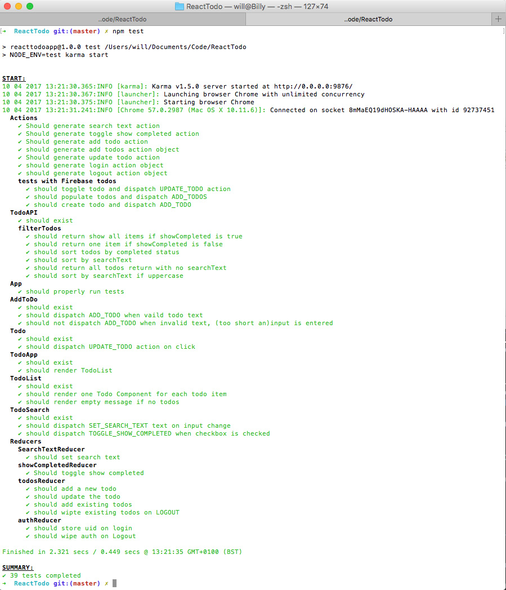

# React Todo App

**A todo list application. Login to your personal List with OAuth, Add, manage, view and search through your todos.**

### [Try the app here](https://secret-cliffs-97435.herokuapp.com/)

Built with:

* **React** -JavaScript Framework
* **Redux** - State Management
* **Webpack** - Compiling code
* **Babel** - ES6 to ES5 for browser compatibility
* **JavaScript ES6** - Latest JavaScript
* **Karma** - Testing environment
* **Mocha** - Testing Framework
* **Foundation** - Front-end Framework
* **Firebase** - Database and OAuth Authentication
* **Heroku** - Deployment
* **Git/GitHub** - Version Control
* **Chrome Developer Tools**
* **React and Redux Developer Tools**

Automated Testing in the browser was setup with Karma.

This project was built as the third and final project as part of the *Complete React Web App Developer Course* by Andrew Mead on [Udemy](https://www.udemy.com/the-complete-react-web-app-developer-course/)

#### To run the project locally:

Clone this repository:
`git clone git@github.com:willcook4/react-todo.git`

Install the Node Packages:
`npm i`

Run the Karma test suite with all 39 tests with:
`npm test`

Run the app locally with `node server.js`

Go to `http://localhost:3000` in your browser of choice.
